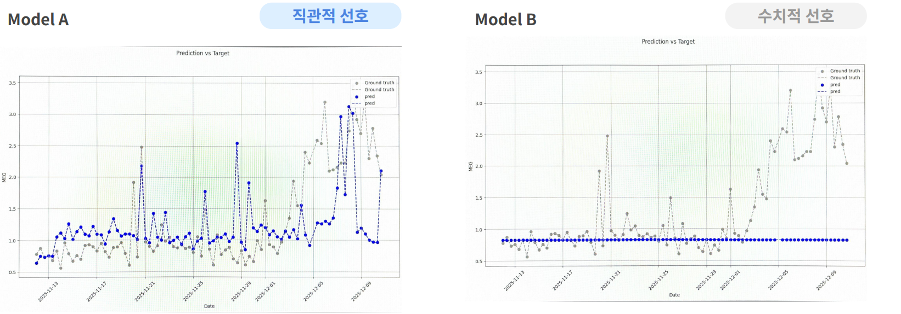

# When Standard ML Metrics Choose the Wrong Model

> A model-selection case study from an industrial quality predictor: the textbook metrics
> (MAE, R²) pointed clearly to one model — but a set of **domain-aware custom metrics**
> revealed the opposite, preventing an operationally blind model from going to production.
>
> *Industrial data is confidential — process names are generalized and only relative,
> non-identifying figures are shown.*

---

## 1. Context

We had to choose between two candidate models, **Model A** and **Model B**, for predicting a
quality metric in a chemical manufacturing process.

The signal is **stable most of the time**. What actually carries operational and safety risk
is the rare **unstable / off-spec ("hunting") regime** — the periods the process drifts out of
spec. A useful model is one that can **see those moments coming**, not one that minimizes error
on the easy, stable majority.

That distinction turned out to decide everything.

*Prediction vs. ground truth. **Model A** (left) follows the real dynamics, including the off-spec spikes. **Model B** (right) earns a low average error by staying near the mean — and misses every excursion.*

---

## 2. The trap: standard metrics pick Model B

| Metric | Model A | Model B |
|---|---|---|
| MAE | 0.284 | **0.0898** |
| R² | −13.42 | **−0.008** |

By every general-purpose metric, **Model B wins, decisively.** If you stop here, you ship B.

---

## 3. Why these metrics lie in this setting

- **The stable region dominates the average.** MAE / MSE / RMSE / MAPE are averaged over a signal
  that is calm most of the time, so they mostly measure performance where performance doesn't matter.
- **A flat predictor scores great.** Model B's R² ≈ 0 is the tell-tale signature of a model
  predicting close to a constant / the mean. It earns a low MAE precisely by *not* moving — and a
  model that doesn't move can never anticipate an off-spec event.
- **The right model gets punished.** Model A tries to track sharp process dynamics; when it's
  occasionally off, squared-error metrics hammer it (R² −13.42). The metric penalizes exactly the
  behavior we need.

The standard scoreboard was measuring the wrong thing.

---

## 4. Designing domain-aware metrics

Instead of *"how small is the average error?"* I evaluated *"does the model capture the behavior
operators actually depend on?"* — and built metrics for it:

| Custom metric | What it captures |
|---|---|
| **Trend Correlation** | Does the prediction move *with* the true signal's shape and direction? |
| **Mean Directional Accuracy (MDA)** | How often does it get the *direction of change* right? |
| **Lag-aware MAE** | Error after accounting for the process's physical time-lag |
| **Activity / moving-average R²** | Does it reproduce the signal's *variability*, not just its mean? |
| **Adjusted MAE / R² (Adj)** | Error re-weighted toward the off-spec / "hunting" regime that matters |

These encode domain knowledge directly into the definition of "good."

---

## 5. The reversal: Model A wins where it counts

| Metric | Model A | Model B |
|---|---|---|
| Trend Correlation | **0.60** | 0.00 |
| Activity | **0.428** | 0.40 |
| Mean Directional Accuracy | **49.4%** | 1.18% |

Model B's **near-zero trend correlation** confirms the diagnosis: it is essentially predicting a
flat line. **Model A actually tracks the process dynamics** — the early movement that precedes an
off-spec event — which is the entire point of the system.

The model that *looked* worse by textbook metrics was the **right** model for the job.

---

## 6. Why it matters

- Relying on standard metrics alone would have shipped **Model B**: excellent on paper,
  operationally blind.
- The real deliverable here was not a model — it was the **definition of "good"** for this problem.
- Encoding domain knowledge into the evaluation metric is what turned a quality predictor into a
  **proactive early-warning** tool for out-of-spec risk.

---

## 7. Takeaway

The highest-leverage work in applied ML isn't always the modeling. Here it was recognizing that the
standard scoreboard rewarded the wrong behavior, and designing one that rewarded the behavior the
business actually needed. A model is only as good as the metric you judge it by.

---

*Owned end-to-end — problem framing, metric design, and model selection.*
*Stack: Python, scikit-learn, NumPy, Pandas.*
